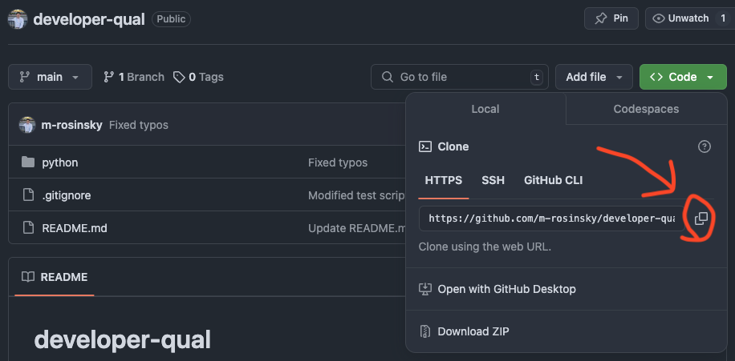

# 00_02 Setup

## What We Need

The only things we should need to write Python effectively for this course are the following:

- The Python interpreter (This course uses Python 3.12)
- A code IDE of your choice (VSCode, Notepad++, IntelliJ, etc.)
- A bash terminal (to run the testing scripts):
    - OSX and Linux have these native in their terminal applications
    - Windows should use a bash emulator like Git Bash
- The `git` command line tool

## Installation

The tools listed above are well-documented and system-independent enough in my opinion that I will skip spelling out how to get them installed in this tutorial.

A Google search for each of the line items should have the sufficient information.

See the next section to verify you've installed everything correctly.

## Verification

Follow these steps to verify you've installed everything:

1. Verify Python:

- We can use the `python3` command in our terminal or bash emulator to verify our installation. I'm writing this course on Windows using the Chocolatey package manager, but this will work on any system:

```
$ python3
Python 3.12.0 (tags/v3.12.0:0fb18b0, Oct  2 2023, 13:03:39) [MSC v.1935 64 bit (AMD64)] on win32
Type "help", "copyright", "credits" or "license" for more information.
>>> 
```

- We should also verify that `pip`, the Python package manager is working:

```
$ python3 -m pip --version
pip 23.2.1 from c:\python312\Lib\site-packages\pip (python 3.12)
```

2. Verify Bash:

- The version number shouldn't matter:

```
$ bash --version
GNU bash, version 5.2.37(1)-release (x86_64-pc-msys)
<...>
```

3. Verify Git:

- It's ok if your version doesn't exactly match here either:

```
$ git --version
git version 2.48.1.windows.1
```

And that's it!

## A Note on Code Editors

The IDE/Editor you use for code is ultimately whatever you're comfortable with.

I will say, however, there are a few key features that make my life much easier when writing Python code:

- Syntax highlighting
- A code server to make auto-complete suggestions
    - VSCode has the `PyLance` extension, which I highly recommend
- A built-in terminal
    - Makes it easier to run your programs and test programs from within your code editor rather than switching tabs
    - Also helpful to run git commands in

## Clone the Repo

If you haven't already, to work in this repo, we'll need to clone it from Github.

Here's how we can do that:

1. Navigate to the git repo in a web browser
2. Click the green 'Code' button, and copy the HTTPS link:

|  | |
|:--:|:--:|
| _Cloning the Repo_ | |

3. Open a terminal window and navigate to the directory in which you would like to clone
4. Run the following command:

```bash
$ git clone <paste link>
```

This will bring the repo to your local machine, where you can work on the exericses.

## Conclusion

Now that we've got our environment set up, let's write our first 'Hello, World' program!
