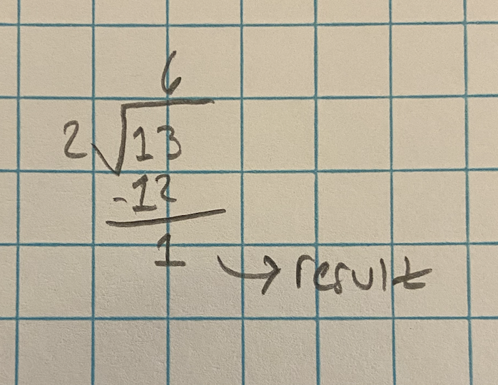

# 01_03 Arithmetic

## Basic Arithmetic

Python supports the basic mathematical operators for numerical values:

| Operation | Operator | Description |
| --- | --- | --- |
| Addition | `+` | Basic addition |
| Subtraction | `-` | Basic subtraction |
| Multiplication | `*` | Basic multiplication |
| Division | `/` | Basic division |

We can use these in our programs just as we would expect:

```python3
# Basic addition.
x = 5 + 4 # 9

# Using multiple operators.
y = x * 2 + 4 # 22

# Python will use PEMDAS order-of-operations.
z = y + 2 * 4 # 30

# Python will also respect parentheses.
w = (z + x) * -1 # -39
```

Try using some of these operators in the REPL!

## Additional Arithmetic Operators

Python also gives us a few additional operators for our convenience:

| Operation | Operator | Description |
| --- | --- | --- |
| Integer (aka 'Floor') Division | `//` | Perform division and round result (always down) to the nearest integer |
| Exponentiation | `**` | `a ** b` Raise `a` to the `b` power |
| Modulus | `%` | Perform division, and use the remainder as the result |

Try some of these out in the REPL:

```python3
x = 14 // 5 # Divide 14 by 5 and round result down.

y = 2 ** 4 # Raise 2 to the 4th power.

z = 13 % 2 # Divide 13 by 2 and give just the remainder.
```

If you're having trouble with the modulus operator, it sometimes helps to imagine it as long division, taking the remainder:


