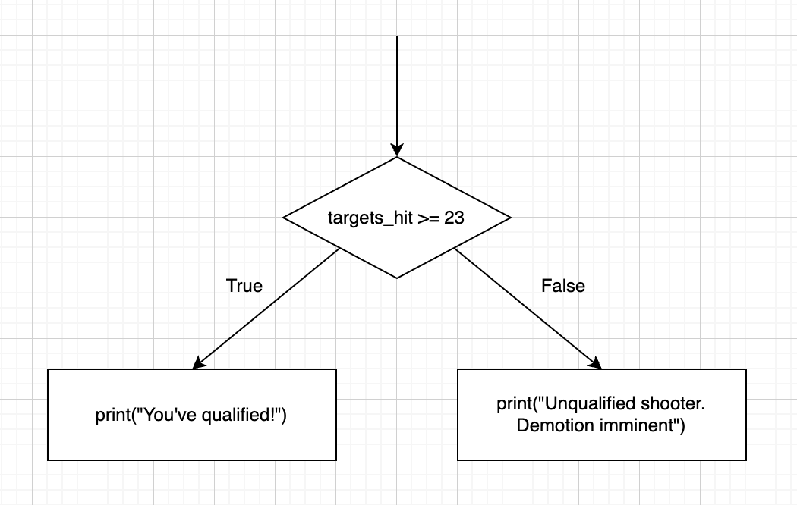
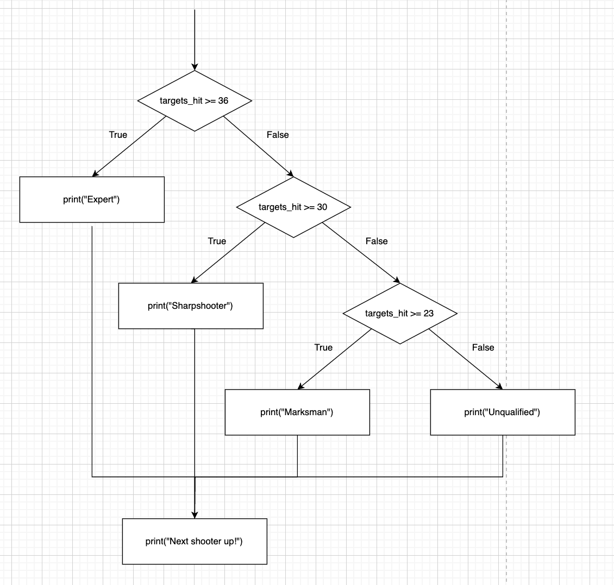

# 02_03 If Else Statements

In the last tutorial we introduced the `if` keyword, along with how to use it in its most basic form.

In this tutorial we expand upon that by a few more keywords: `elif` and `else`.

## The `else` Keyword

When we look at the basic syntax of an `if` block:

```python3
if <condition>:
    <code>
```

We see that the `<code>` block will only be executed when the `<condition>` boolean value evaluates to `True`.

We can use the `else` keyword in conjunction with this to additional code to execute when the boolean value evaluates to `False`. Like so:

```python3
if <condition>:
    <code a>
else:
    <code b>
```

A few things to note here:

1. We see the `:` used again after the `else` keyword to signify that we're opening a code block under the `else`
2. The `else` clause does not take a condition like the `if` clause does.
    - This is because the `else` acts as a catch-all. If the `<condition>` evaluates to `False`, it will execute `<code b>` regardless.

Let's take a look at an example:

```python3
# Targets we hit on the range.
targets_hit = 31

# Let the user know if they qualified or not.
if targets_hit >= 23:
    print("You've qualified!")
else:
    print("Unqualified shooter. Demotion imminent")
```

It may help to visualize these examples with a flowchart:

|  |
| :--: |
| _If-Else Flowchart_ |

This example is pretty trivial, but as we add more complexity to our `if` blocks, it may prove more useful.

## The `elif` Keyword

We can also add additional branches and conditions to our `if` statements.

Imagine instead of simply telling the shooter if they are qualified or unqualified, we can tell them the level of qualification they achieved based on their score.

To accomplish this, we can add more subsequent conditions to the `if` block using the `elif` keyword, which can be read as _else if_:

```python3
targets_hit = 31

# Tell the shooter their level of qual.
if targets_hit >= 36:
    print("Expert")
elif targets_hit >= 30:
    print("Sharpshooter")
elif targets_hit >= 23:
    print("Marksman")
else:
    print("Unqualified")

# Call up the next shooter.
print("Next shooter up!")
```
```
Sharpshooter
Next shooter up!
```

Let's walk through this example.

The first condition is `targets_hit >= 36`, which evaluates to `False`, since 31 is _not_ greater than or equal to 36.

So then we check the next condition, which is `targets_hit >= 30`. In this case, it's `True`! So we execute the code inside this block, which prints `Sharpshooter`.

After we find a condition that is satisfied, we exit from the entire block, so the next condition is not checked, and the `else` clause is not executed!

Since the `print("Next shooter up!")` line is _not_ indented, it is not part of the `if` block. So after we find which branch we execute, this line is executed after no matter what.

This is called _mutual exclusion_, meaning all the branches of the `if` and `elif` statement, as well as the `else` block are mutually exclusive. Only 1 block can be executed!

Let's see the flowchart for this one:

|  |
| :--: |
| _If-Else Flowchart 2_ |

A bit more complex here. Try to take a `targets_hit` number in mind and follow the flow chart!

We can see this in a visual way that only one of these print statements can be executed, then we move onto the next instruction, which is to call for the next shooter.

And we can see that if all of our `if` and `elif` conditions are `False`, the `else` block acts as the catch-all or fall-through.

## Conclusion

In this tutorial, we expanded upon the `if` statements that we covered previously, and introduced the keywords `elif` and `else`, to form more cohesive decision making in our programs.

Try out `exercise_c.py` for practice using `if`-`elif`-`else` blocks!
